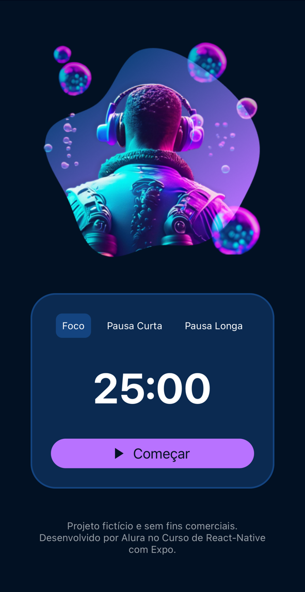

# Fokus - Aplicativo de Gestão de Tempo

Fokus é um aplicativo de gestão de tempo baseado na técnica Pomodoro, desenvolvido com **React Native** e **Expo**. Ele permite que você gerencie seu tempo de forma eficiente, ajudando a manter o foco nas suas tarefas. O aplicativo conta com um cronômetro regressivo, um botão funcional para iniciar e parar a contagem, além de um efeito visual no fundo para indicar o tempo restante.

Este projeto foi desenvolvido como parte do curso [React Native: Desenvolvendo um aplicativo com Expo](https://cursos.alura.com.br/course/react-native-desenvolvendo-expo) da Alura.

## 🚀 Tecnologias Utilizadas

- [React Native](https://reactnative.dev/)
- [Expo](https://expo.dev/)
- [React Hooks (useState)](https://react.dev/reference/react/useState)
- [StyleSheet](https://reactnative.dev/docs/stylesheet)
- [Flexbox](https://reactnative.dev/docs/flexbox)
- [SVG Icons](https://reactnative.dev/docs/image)

## 📱 Desenvolvimento passo a passo realizado

✅ Criar e rodar projetos React Native Expo<br>
✅ Estilização de layouts utilizando StyleSheet<br>
✅ Implementação de componentes básicos como **Image**, **View** e **Text**<br>
✅ Botão interativo para iniciar e parar o cronômetro<br>
✅ Cronômetro regressivo funcional<br>
✅ Manipulação de estado com **useState**<br>
✅ Trabalhar com listas utilizando **.map** e **props**<br>
✅ Efeito visual dinâmico conforme o tempo diminui<br>

## 🎨 Capturas de Tela



## 🛠️ Como Executar o Projeto

Para rodar este projeto localmente, siga os passos abaixo:

### 1️⃣ Pré-requisitos

Certifique-se de ter instalado:
- Node.js
- Expo CLI (`npm install -g expo-cli`)
- Emulador ou dispositivo físico com Expo Go

### 2️⃣ Clonar o Repositório
```sh
 git clone https://github.com/TalesCostta/fokus-expo-course-alura.git
 cd fokus-expo-course-alura
```

### 3️⃣ Instalar Dependências
```sh
 npm install
```

### 4️⃣ Executar o Aplicativo
```sh
 expo start
```

Escaneie o QR Code com o aplicativo **Expo Go** para rodar no celular ou use um emulador.

## 📜 Licença

Este projeto está sob a licença MIT. Sinta-se à vontade para contribuir! 🧑‍💻

---

Feito com ❤️ durante o curso de React Native! 🚀

